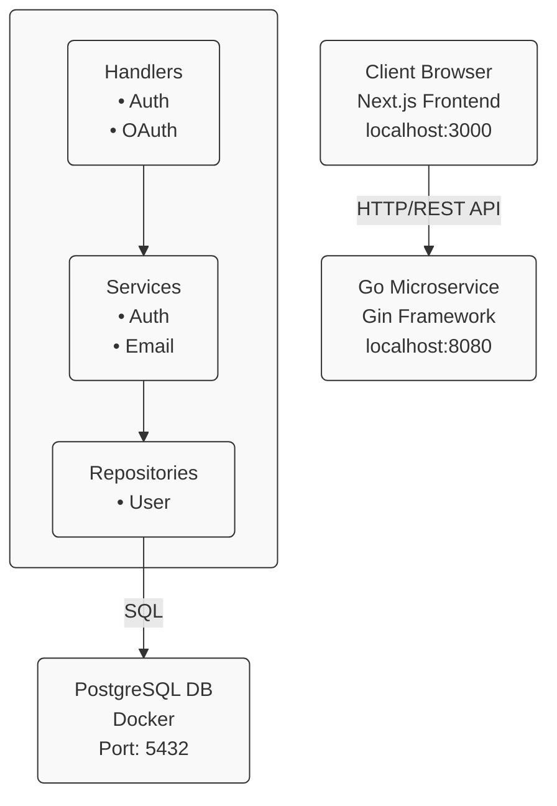
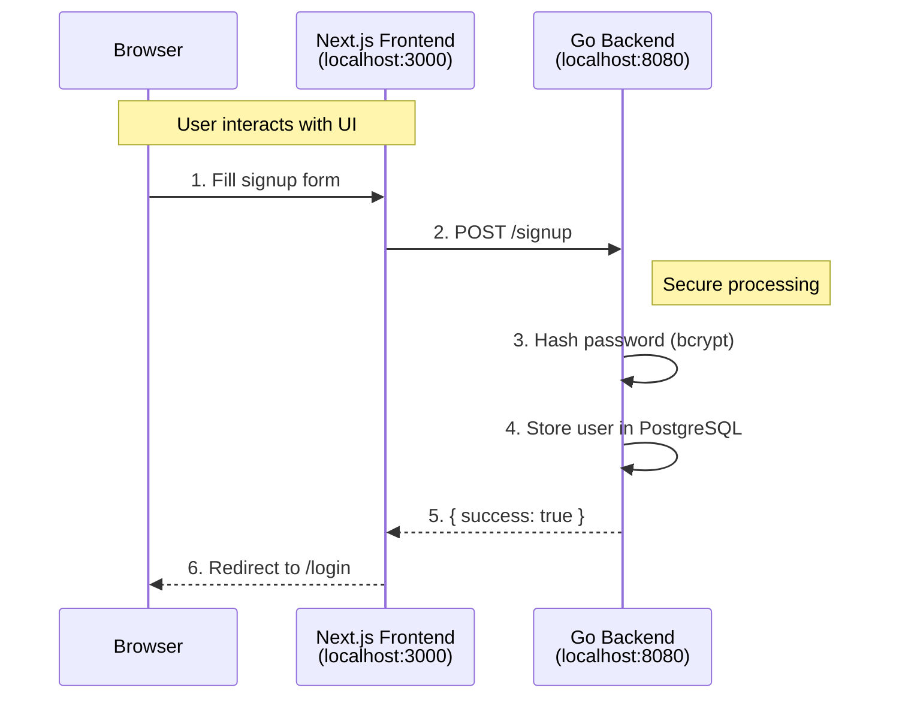
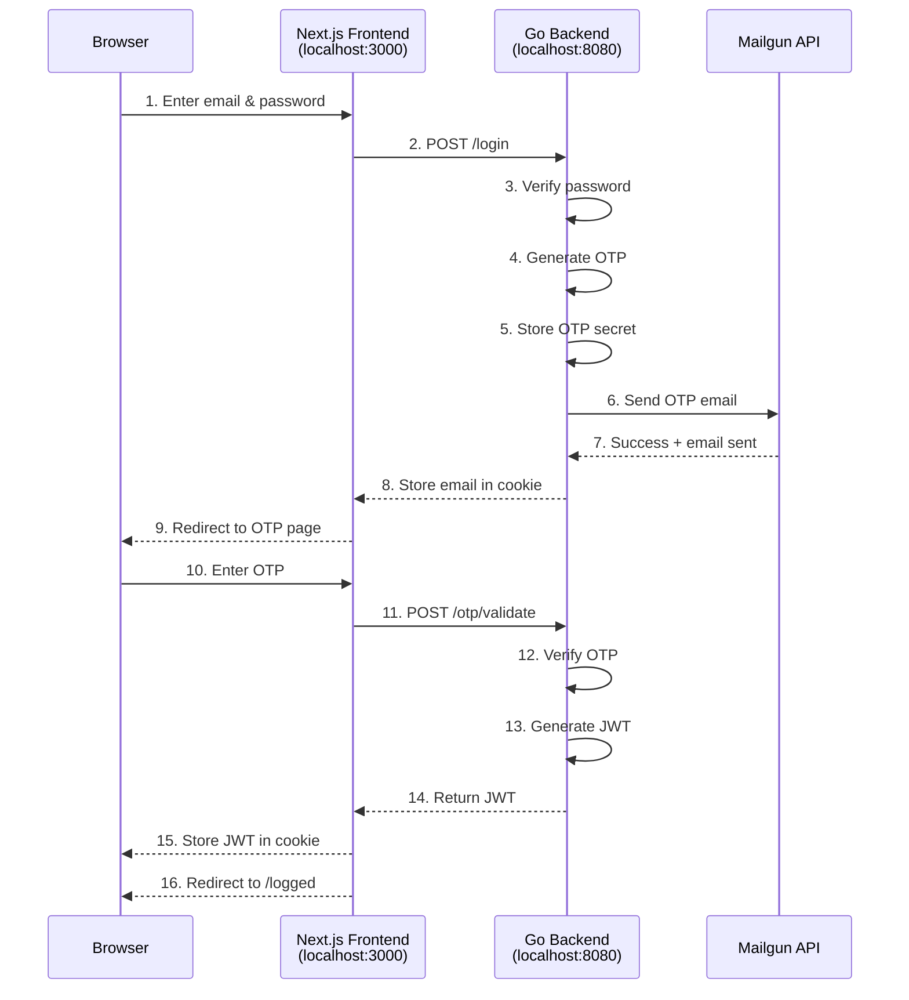
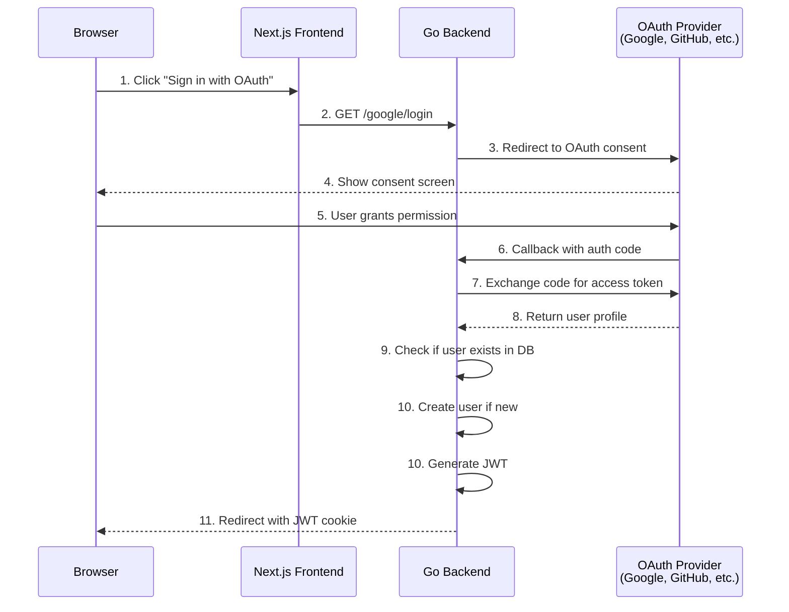
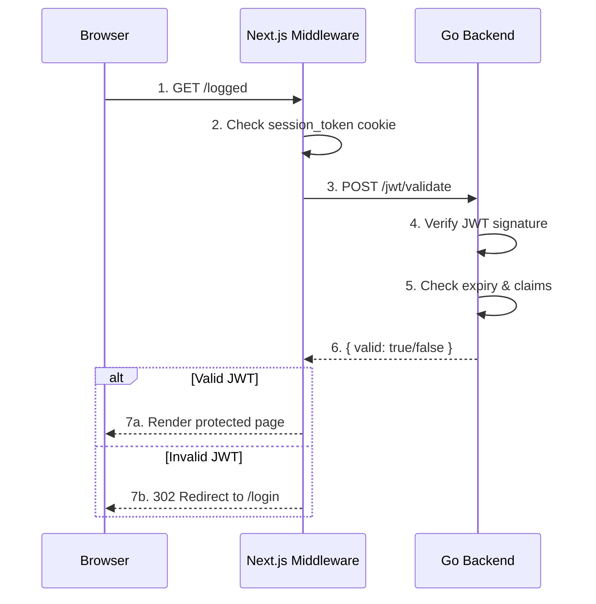

# Secure Auth Service

A full-stack authentication system featuring a Next.js frontend and a Go microservice backend with multiple authentication methods including email/password with OTP verification and OAuth (Google & GitHub).

## Table of Contents

- [Architecture Overview](#architecture-overview)
- [Features](#features)
- [Tech Stack](#tech-stack)
- [Getting Started](#getting-started)
- [Authentication Flows](#authentication-flows)
- [API Endpoints](#api-endpoints)
- [Environment Variables](#environment-variables)

## Architecture Overview

This project follows a microservices architecture with clear separation between the frontend and backend services.



### Component Responsibilities

- **Frontend (Next.js)**: User interface, form handling, client-side routing, session management
- **Backend (Go)**: Business logic, authentication, OTP generation/validation, JWT management
- **Database (PostgreSQL)**: User data persistence, credentials storage

## Features

- ✅ **Email/Password Authentication** with OTP verification
- ✅ **OAuth Integration** (Google & GitHub)
- ✅ **JWT-based Session Management**
- ✅ **Secure Password Hashing** (SHA-256)
- ✅ **OTP Email Delivery** via Mailgun
- ✅ **Protected Routes** with middleware
- ✅ **Responsive UI** with Tailwind CSS and shadcn/ui
- ✅ **Docker Compose** for easy deployment

## Tech Stack

### Frontend
- **Next.js 15.5** - React framework with App Router
- **React 19** - UI library
- **TypeScript** - Type safety
- **Tailwind CSS v4** - Styling
- **shadcn/ui** - UI components
- **Server Actions** - Form handling

### Backend
- **Go 1.x** - Programming language
- **Gin** - HTTP web framework
- **GORM** - ORM for database operations
- **JWT** - Token-based authentication
- **TOTP** - Time-based OTP generation
- **Goth** - OAuth provider integration

### Database
- **PostgreSQL 15** - Relational database

### DevOps
- **Docker Compose** - Container orchestration

## Getting Started

### Prerequisites

- Docker and Docker Compose installed
- Go 1.21+ (for local development)
- Node.js 20+ (for local development)
- Mailgun account (for email OTP delivery)
- Google OAuth credentials (optional, for Google login)
- GitHub OAuth credentials (optional, for GitHub login)

### Installation

1. **Clone the repository**
   ```bash
   git clone <repository-url>
   cd secure-auth-service
   ```

2. **Set up the microservice environment variables**
   
   Create a `.env` file in the `microservice/` directory:
   ```bash
   # Server Configuration
   PORT=:8080

   # Database Configuration
   DB_USER=postgres
   DB_PASSWORD=postgres
   DB_NAME=secure_auth_db
   DB_HOST=db

   # JWT Configuration
   JWT_SECRET=your-super-secret-jwt-key-change-this-in-production

   # OTP Configuration
   OTP_ISSUER=SecureAuthService

   # Email Service (Mailgun)
   MAILGUN_DOMAIN=your-mailgun-domain.com
   MAILGUN_API_KEY=your-mailgun-api-key
   EMAIL_FROM=noreply@your-domain.com

   # Google OAuth (Optional)
   GOOGLE_CLIENT_ID=your-google-client-id
   GOOGLE_CLIENT_SECRET=your-google-client-secret
   GOOGLE_REDIRECT_URL=http://localhost:8080/google/callback

   # GitHub OAuth (Optional)
   GITHUB_CLIENT_ID=your-github-client-id
   GITHUB_CLIENT_SECRET=your-github-client-secret
   GITHUB_REDIRECT_URL=http://localhost:8080/github/callback
   ```

3. **Set up the frontend environment variables**
   
   Create a `.env.local` file in the `frontend/` directory:
   ```bash
   # Backend API Endpoints
   AUTH_SERVICE_LOGIN_ENDPOINT=http://localhost:8080/login
   AUTH_SERVICE_SIGNUP_ENDPOINT=http://localhost:8080/signup
   AUTH_SERVICE_OTP_VALIDATE_ENDPOINT=http://localhost:8080/otp/validate
   AUTH_SERVICE_JWT_VALIDATE_ENDPOINT=http://localhost:8080/jwt/validate
   ```

4. **Start the database with Docker Compose**
   ```bash
   docker-compose up -d
   ```
   
   This will:
   - Start PostgreSQL on port 5432
   - Automatically run the initialization script (`db/init_db.sql`)
   - Create the `users` table
   - Seed with a test user (email: `user@example.com`, password: `user`)

5. **Start the Go microservice**
   ```bash
   cd microservice
   go mod download
   go run main.go
   ```
   
   The API will be available at `http://localhost:8080`

6. **Start the Next.js frontend**
   ```bash
   cd frontend
   npm install
   npm run dev
   ```
   
   The frontend will be available at `http://localhost:3000`

## Authentication Flows

### 1. Email/Password Signup Flow



**Steps:**
1. User fills out signup form (full name, email, password, confirm password)
2. Frontend sends POST request to `/signup` endpoint
3. Backend hashes the password using SHA-256
4. Backend stores user in PostgreSQL database
5. Backend returns success response
6. Frontend redirects user to login page

### 2. Email/Password Login Flow with OTP



**Steps:**
1. User enters email and password on login page
2. Frontend sends POST request to `/login` endpoint
3. Backend verifies password against stored hash
4. Backend generates a 6-digit TOTP code
5. Backend stores OTP secret in database
6. Backend sends OTP via email using Mailgun
7. Backend returns success with user email
8. Frontend stores email in `login_intent` cookie
9. Frontend redirects to OTP verification page
10. User enters the 6-digit OTP from email
11. Frontend sends POST request to `/otp/validate` with email and OTP
12. Backend verifies OTP against stored secret
13. Backend generates JWT token (15-minute expiry)
14. Backend returns JWT token
15. Frontend stores JWT in `session_token` cookie
16. Frontend redirects to protected `/logged` page

### 3. OAuth Login Flow (Google/GitHub)



**Steps:**
1. User clicks Google or GitHub login button
2. Frontend redirects to backend OAuth endpoint (`/google/login` or `/github/login`)
3. Backend redirects to OAuth provider's consent page
4. User is redirected to OAuth provider (Google/GitHub)
5. User grants permission to the application
6. OAuth provider redirects back to backend callback URL with authorization code
7. Backend exchanges authorization code for access token
8. Backend retrieves user profile from OAuth provider
9. Backend checks if user exists in database (by email)
10. Backend generates JWT token
11. Backend redirects to frontend with JWT stored in cookie
12. Frontend redirects to protected `/logged` page

### 4. Protected Route Access



**Steps:**
1. User attempts to access protected route (`/logged`)
2. Next.js middleware intercepts the request
3. Middleware checks for `session_token` cookie
4. Middleware sends POST request to `/jwt/validate` with token
5. Backend verifies JWT signature and expiration
6. Backend returns validation result
7. If valid: User sees protected page
8. If invalid: User is redirected to login page


## API Endpoints

### Authentication Endpoints

| Method | Endpoint | Description | Request Body | Response |
|--------|----------|-------------|--------------|----------|
| POST | `/signup` | Register new user | `{ full_name, email, password, confirm_password }` | `{ message, data }` |
| POST | `/login` | Authenticate user | `{ email, password }` | `{ message, data }` |
| POST | `/otp/validate` | Verify OTP code | `{ email, otp }` | `{ message, token }` |
| POST | `/otp/resend` | Resend OTP email | `{ email }` | `{ message }` |
| POST | `/jwt/validate` | Validate JWT token | Header: `Authorization: <token>` | `{ message, user }` |

### OAuth Endpoints

| Method | Endpoint | Description |
|--------|----------|-------------|
| GET | `/google/login` | Initiate Google OAuth flow |
| GET | `/google/callback` | Google OAuth callback |
| GET | `/github/login` | Initiate GitHub OAuth flow |
| GET | `/github/callback` | GitHub OAuth callback |

## Environment Variables

### Microservice (.env)

```bash
# Server
PORT=:8080

# Database
DB_USER=postgres
DB_PASSWORD=postgres
DB_NAME=secure_auth_db
DB_HOST=db

# JWT
JWT_SECRET=your-secret-key

# OTP
OTP_ISSUER=SecureAuthService

# Email (Mailgun)
MAILGUN_DOMAIN=your-domain.com
MAILGUN_API_KEY=your-api-key
EMAIL_FROM=noreply@your-domain.com

# Google OAuth (Optional)
GOOGLE_CLIENT_ID=your-client-id
GOOGLE_CLIENT_SECRET=your-client-secret
GOOGLE_REDIRECT_URL=http://localhost:8080/google/callback

# GitHub OAuth (Optional)
GITHUB_CLIENT_ID=your-client-id
GITHUB_CLIENT_SECRET=your-client-secret
GITHUB_REDIRECT_URL=http://localhost:8080/github/callback
```

### Frontend (.env.local)

```bash
AUTH_SERVICE_LOGIN_ENDPOINT=http://localhost:8080/login
AUTH_SERVICE_SIGNUP_ENDPOINT=http://localhost:8080/signup
AUTH_SERVICE_OTP_VALIDATE_ENDPOINT=http://localhost:8080/otp/validate
AUTH_SERVICE_JWT_VALIDATE_ENDPOINT=http://localhost:8080/jwt/validate
```

## Security Features

- **Password Hashing**: SHA-256 hashing for password storage
- **OTP Verification**: Time-based one-time passwords (TOTP) for two-factor authentication
- **JWT Tokens**: Secure session management with 15-minute expiry
- **CORS Protection**: Configured to allow only frontend origin
- **HTTP-only Cookies**: Session tokens stored in secure cookies
- **Middleware Protection**: Route-level authentication checks

## Troubleshooting

### Common Issues

1. **Database connection failed**
   - Ensure Docker is running
   - Check if port 5432 is available
   - Verify database credentials in `.env`

2. **OTP emails not sending**
   - Verify Mailgun credentials
   - Check Mailgun domain verification
   - Review backend logs for email service errors

3. **OAuth not working**
   - Verify OAuth credentials
   - Check redirect URLs match OAuth app settings
   - Ensure callback URLs are accessible

